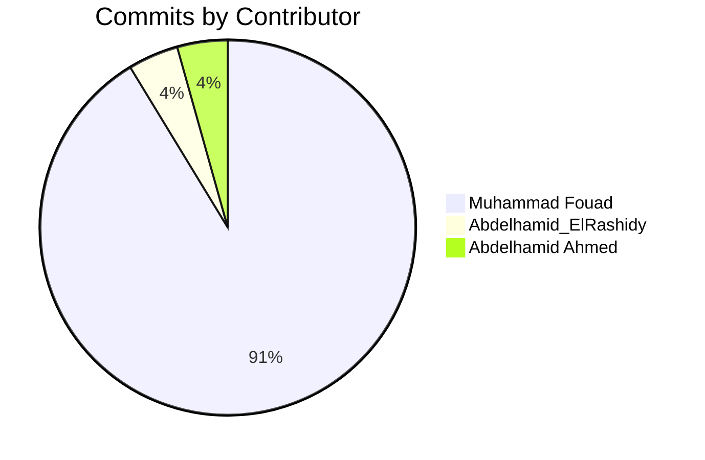

# Library_System

A modern library management system with a refined admin dashboard.

## 📊 Contributors & Statistics

### Commit Distribution

### Repository Activity

### Project Stats

  

## 👥 Contributors

---
*Last updated: 2025-03-13*