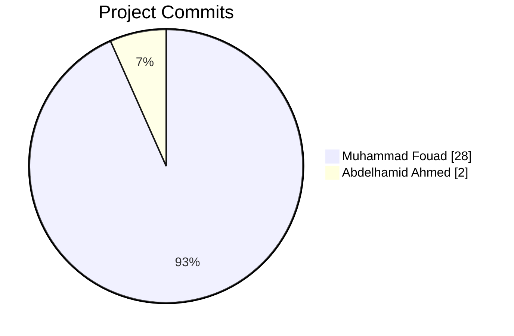

# 📚 Library System

A premium, modern library management platform.

---

## 🔗 Quick Navigation

| Status | Page | Link |
| :--- | :--- | :--- |
| 🏠 | **Admin Dashboard** |  |
| ➕ | **Inventory Management** |  |
| ✏️ | **Data Control** |  |
| 📖 | **Project Guide** |  |

---

## 📊 Analytics & Insights

### 📈 Contribution Breakdown

---

## 👥 The Team

  

